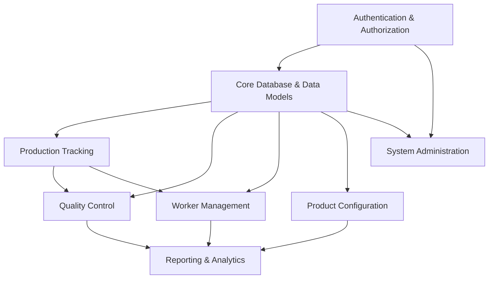

# ZMF Production Dashboard - Modular Architecture

## Executive Summary

This document outlines the modular architecture for the ZMF Production Dashboard, breaking down the system into independent, testable modules that can be developed incrementally. Each module has clear boundaries, dependencies, and interfaces.

## Core System Modules

### 1. Authentication & Authorization Module

**Purpose**: Handle user authentication, role management, and access control.

**Dependencies**: 
- Supabase Auth
- Database (workers table)

**Key Components**:
- Authentication middleware
- Role-based access control (RBAC)
- Session management
- Auth UI components (login, logout, password reset)

**Database Tables**:
- `workers` (links to auth.users)
- RLS policies for all tables

**Implementation Priority**: HIGH (Required for all other modules)

---

### 2. Core Database & Data Models Module

**Purpose**: Define and manage the core data structure and relationships.

**Dependencies**: 
- Supabase PostgreSQL
- Authentication Module

**Key Components**:
- Database schema
- Type definitions
- Data access layer
- Migration management

**Database Tables**:
- `headphone_models`
- `customers`
- `orders`
- `batches`
- `batch_orders`
- All enum types

**Implementation Priority**: HIGH (Foundation for all data operations)

---

### 3. Production Tracking Module

**Purpose**: Track orders through production stages.

**Dependencies**:
- Core Database Module
- Authentication Module

**Key Components**:
- Production pipeline view
- Stage assignment system
- Batch management
- Order tracking
- Production calendar

**Database Tables**:
- `stage_assignments`
- `batches`
- `batch_orders`

**Implementation Priority**: HIGH (Core business function)

---

### 4. Quality Control Module

**Purpose**: Manage quality checks and issue tracking.

**Dependencies**:
- Core Database Module
- Production Tracking Module
- Authentication Module

**Key Components**:
- Quality checklists
- Issue reporting system
- QC dashboards
- Photo upload for issues
- Resolution tracking

**Database Tables**:
- `quality_checks`
- `issues`
- Storage bucket: `quality-photos`

**Implementation Priority**: HIGH (Critical for product quality)

---

### 5. Worker Management Module

**Purpose**: Manage worker profiles, assignments, and performance.

**Dependencies**:
- Authentication Module
- Core Database Module

**Key Components**:
- Worker profiles
- Skill/specialization tracking
- Performance metrics
- Assignment system
- Worker dashboards

**Database Tables**:
- `workers`
- `production_metrics`
- `stage_assignments`

**Implementation Priority**: MEDIUM

---

### 6. Product Configuration Module

**Purpose**: Manage product variants and Shopify integration.

**Dependencies**:
- Core Database Module
- External API (Shopify)

**Key Components**:
- Product configurator UI
- Option/variant management
- Pricing calculator
- Shopify API integration
- Configuration sync

**Database Tables**:
- `product_configurations`
- `product_options`
- `option_values`
- `shopify_api_logs`

**Implementation Priority**: MEDIUM (Revenue generation)

---

### 7. Reporting & Analytics Module

**Purpose**: Provide insights and metrics.

**Dependencies**:
- All data modules
- Authentication Module

**Key Components**:
- Production dashboards
- Quality metrics
- Worker performance reports
- Order analytics
- Export functionality

**Database Tables**:
- `production_metrics`
- `system_logs`
- Read from all tables

**Implementation Priority**: LOW (Can be added incrementally)

---

### 8. System Administration Module

**Purpose**: System configuration and monitoring.

**Dependencies**:
- Authentication Module
- All other modules

**Key Components**:
- User management
- System settings
- Audit logs
- Health monitoring
- Backup management

**Database Tables**:
- `system_logs`
- `workers` (admin functions)

**Implementation Priority**: LOW

---

## Module Dependencies Graph

## Database Schema Overview

### Core Enums
- `production_stage`: Intake → Sanding → Finishing → Sub-Assembly → Final Assembly → Acoustic QC → Shipping
- `quality_status`: good, warning, critical, hold
- `worker_role`: worker, manager, admin
- `batch_priority`: standard, rush, expedite
- `order_status`: pending, in_production, completed, shipped, on_hold

### Key Relationships
1. Orders → Customers, Headphone Models
2. Batches ↔ Orders (many-to-many)
3. Stage Assignments → Batches, Workers
4. Quality Checks → Orders, Batches, Workers
5. Issues → Orders, Batches, Workers
6. Production Metrics → Workers, Models

## Implementation Strategy

### Phase 1: Foundation (Weeks 1-2)
1. Authentication & Authorization Module
2. Core Database & Data Models Module
3. Basic UI framework

### Phase 2: Core Business (Weeks 3-4)
1. Production Tracking Module
2. Quality Control Module
3. Worker interfaces

### Phase 3: Enhancement (Weeks 5-6)
1. Worker Management Module
2. Product Configuration Module
3. Manager dashboards

### Phase 4: Polish (Weeks 7-8)
1. Reporting & Analytics Module
2. System Administration Module
3. Performance optimization
4. Testing & bug fixes

## Testing Strategy

### Unit Testing
- Test each module in isolation
- Mock dependencies
- Focus on business logic

### Integration Testing
- Test module interactions
- Test database operations
- Test API endpoints

### E2E Testing
- Test complete workflows
- Test role-based access
- Test error scenarios

## Security Considerations

1. **Row Level Security (RLS)**: Mandatory on all tables
2. **Authentication**: Server-side validation only
3. **Authorization**: Role-based with granular permissions
4. **Data Access**: Scoped to user context
5. **API Security**: Rate limiting, input validation
6. **Audit Trail**: System logs for all critical operations

## Performance Optimization

1. **Database Indexes**: On all foreign keys and RLS policy columns
2. **Query Optimization**: Use database views for complex queries
3. **Caching**: TanStack Query for client-side caching
4. **Lazy Loading**: Dynamic imports for heavy components
5. **Server Components**: Default for better performance

## Next Steps

1. Review and approve this architecture
2. Set up development environment
3. Begin with Authentication Module
4. Create detailed implementation plans for each module
5. Set up CI/CD pipeline
6. Establish coding standards and review process